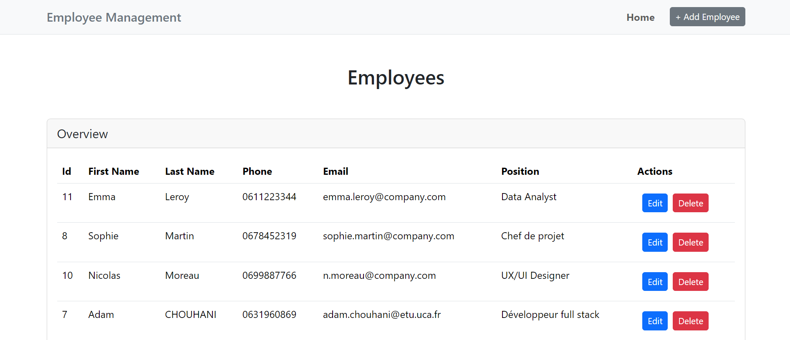
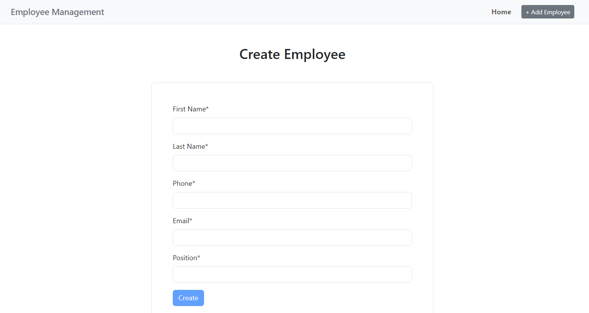

# Employee Management System — Full-Stack Monorepo

A **full-stack Employee Management System** built with **ASP.NET (Web API)** and **Angular**, designed using **real-world architecture, validation, and styling best practices**.

This project demonstrates my ability to design, structure, and implement a **scalable enterprise-style application** using modern frontend and backend technologies within a **single monorepo**.

---

## Images

### Home Screen



### Add Employee



## Project Goals

- Build a **clean, maintainable full-stack application**
- Apply **backend API design best practices**
- Implement **Angular architecture used in real projects**
- Focus on **UI/UX styling**, **form validation**, and **data integrity**
- Structure the codebase as a **professional monorepo**

---

## Features

### Employee Management

- Create, update, delete, and view employees
- Structured data flow between frontend and backend
- Clean separation between API and UI logic

### Backend — ASP.NET Web API

- RESTful API architecture
- Validation layer to ensure data consistency
- Scalable folder structure
- Ready for database integration and authentication

### Frontend — Angular

- Modular Angular architecture
- Feature-based folder structure
- Reusable components and services
- Reactive forms
- HTTP communication with backend API

### Styling & UX

- Clean and consistent UI
- Responsive layout
- Maintainable styling approach
- Focus on readability and usability

### Validation

- Backend validation for data integrity
- Frontend form validation for user experience
- Clear validation messages
- Defensive programming mindset

---

## Tech Stack

### Backend

- **ASP.NET Core**
- C#
- REST APIs
- Validation

### Frontend

- **Angular**
- TypeScript
- Reactive Forms
- Angular Services & Modules

### Tooling

- Git & GitHub
- Monorepo architecture
- Shared `.gitignore`

---

## Learning & Architecture Focus

This project is not just about functionality — it focuses on:

- Clean code principles
- Separation of concerns
- Scalable architecture
- Real-world development practices
- Code readability and maintainability

---

## How to Run the Project

### Backend (API)

```bash
cd EmployeeManagementAPi
dotnet restore
dotnet run
```

### Frontend (Angular)

```bash
cd employee-management-app
npm install
ng serve
```

---

## Why This Project Matters

This repository reflects how I approach **real software development**, not just tutorials:

- I structure projects for **growth**
- I think about **maintainability**
- I apply **validation and architecture patterns**
- I build frontend and backend as **independent but connected systems**

---

## About Me

I’m a **full-stack developer student** focused on building **clean, scalable, and maintainable applications** using modern technologies.
